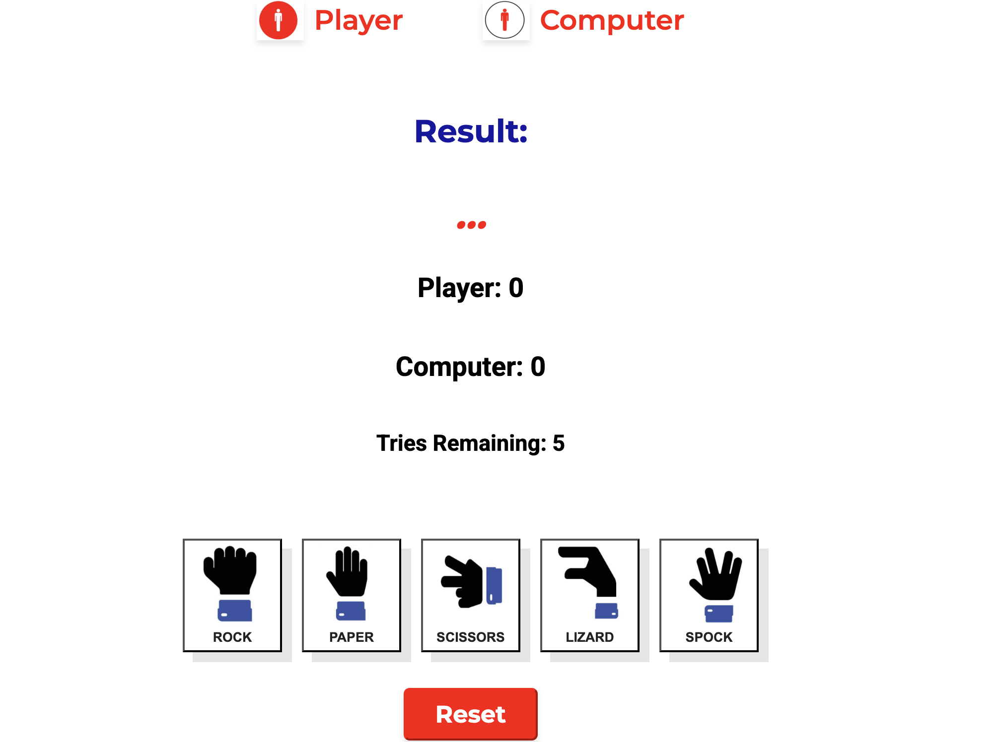

# ROCK, PAPER, SICOSSRS, LIZARD, SPOCK #

Spoks Lizard, is an exciting and dynamic browser-based game where the user compete against the computer in a fun and strategic showdown. The user can test their skills, and ability to make quick decisions, aiming for the highest score. With engaging gameplay and simple controls, Spoks Lizard is perfect for both casual players and seasoned gamers, or just for a moment of entertainment, while sitting in a waiting room or standing in line.

## GAME ##

- Utilizing a clean and simple design, the game is easy to play and understand.
- The intuitive layout and the  interactive button that altering their size when clicked, ensure players can easily navigate the game, track their scores, and reset the game with ease.

## FEATURES LEFT TO IMPLEMENT

•	Adding a feature where the user can choose to play with friends and not only against the computer. 

## TESTING ##
The Rock, Paper, Scissors, Lizard, Spock game works on various devices and screen sizes.

## VALIDATOR TESTING ##

####	HTML ####

- 	No errors were returned when passing through the official W3C validator

- 	Result:  https://validator.w3.org/nu/?doc=https%3A%2F%2Fagnieszkalukasiak.github.io%2FProject2%2F

#### CSS ####

- No errors were found when passing through the official (Jigsaw) validator .
- Result : https://jigsaw.w3.org/css-validator/validator?uri=https%3A%2F%2Fagnieszkalukasiak.github.io%2FProject2%2F&profile=css3svg&usermedium=all&warning=1&vextwarning=&lang=en

#### JAVA SCRIPT ####

- No errors were found when passing through the official ( Jshint).
- Link  https://jshint.com/ 

### Unfixed Bugs ###

There are no unfixed bugs.

### Deployment ###

-	The site was deployed to GitHub pages. The steps to deploy are as follows:
-	In the GitHub repository, navigate to the Settings tab
-	From the source section drop-down menu, select the Master Branch
-	Once the master branch has been selected, the page will be automatically refreshed with a detailed ribbon display to indicate the successful deployment.

The live link can be found here : https://agnieszkalukasiak.github.io/Project2/

### CREDITS ###

From my mentor: Moritz Wach.

The arrow function from : www.w3schools.com/js/js_arrow_function.asp

The reload function: https://www.freecodecamp.org/news/javascript-refresh-page-how-to-reload-a-page-in-js/

Switch function: https://support.microsoft.com/en-us/office/switch-function-47ab33c0-28ce-4530-8a45-d532ec4aa25e

To better understand the underlying thinking : https://www.codespud.com/2022/rock-paper-scissors-lizard-spock/

Asked ChatGPT for help with checking why some of the code wasn’t working.

### CONTENT ###

- The text was written by me. 

### MEDIA ###

-	Favicons taken from: https://icons8.com/icons/set/favicon-game
-	Icons for rock, paper, scissors, lizard, spock: https://www.pngegg.com/
